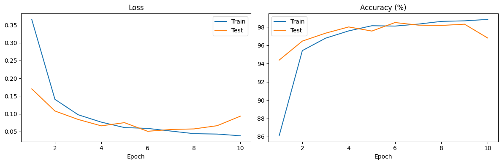
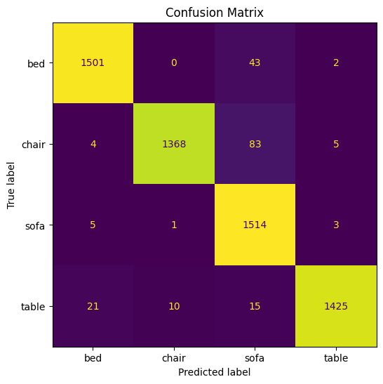

# Furniture Classifier

A CNN-based image classifier that recognises 4 categories of indoor furniture from a single photograph.

**Classes:** bed · chair · sofa · table

---

## Model architecture

`FurnitureClassifier` is a custom 3-block CNN trained from scratch with PyTorch. Each block uses two convolutional layers with ReLU activations, then a MaxPool to progressively reduce spatial dimensions while increasing feature depth.

```
Input  3 x 64 x 64
  Block 1   Conv(3->60)   -> ReLU -> Conv(60->120, stride=2) -> ReLU -> MaxPool(2) -> 120x16x16
  Block 2   Conv(120->80) -> ReLU -> Conv(80->120)            -> ReLU -> MaxPool(2) -> 120x8x8
  Block 3   Conv(120->80) -> ReLU -> Conv(80->10)             -> ReLU -> MaxPool(2) ->  10x4x4
  Head      Flatten(160)  -> Linear(160, 4)
```

| Param         | Value  |
|---------------|--------|
| hidden_units  | 10     |
| Input size    | 64×64  |
| Optimizer     | SGD    |
| Learning rate | 0.1    |
| Batch size    | 32     |

---

## Results

Trained for 10 epochs on a T4 GPU (Google Colab):



| Epoch | Train Loss | Train Acc | Test Loss | Test Acc |
|-------|-----------|-----------|----------|---------|
| 1     | 0.3658    | 86.1%     | 0.1702   | 94.4%   |
| 5     | 0.0612    | 98.2%     | 0.0750   | 97.6%   |
| **6** | **0.0589**| **98.1%** | **0.0507**| **98.5%** |
| 10    | 0.0381    | 98.8%     | 0.0933   | 96.8%   |

**Best test accuracy: 98.5%** — train and test curves stay close throughout, indicating minimal overfitting.

### Confusion Matrix



---

## Repository layout

```
classification-model/
├── src/
│   ├── __init__.py     # Public API: FurnitureClassifier, load_model, predict
│   ├── model.py        # FurnitureClassifier definition
│   ├── dataset.py      # Transforms and CLASS_NAMES
│   ├── predict.py      # Inference (downloads weights from HF Hub)
│   └── train.py        # Training script (CLI)
├── app/
│   └── app.py          # Gradio demo
├── check_data.py       # Dataset sanity-checker (class balance, corrupt/small images)
├── assets/
│   ├── training_metrics.png
│   └── confusion_matrix.png
├── examples/           # Sample images used by the demo app
├── sample_images/      # Labelled images for spot-checking predictions
└── requirements.txt
```

---

## Quick start

### 1. Install dependencies

```bash
pip install -r requirements.txt
```

### 2. Run the demo app

```bash
python app/app.py
```

The app downloads the model weights from HuggingFace Hub on first launch (cached locally afterwards),
then opens a local web UI where you can upload any furniture image and see the predictions.

### 3. Run inference from Python

```python
from PIL import Image
from src.predict import predict

image = Image.open("your_image.jpg")
results = predict(image)          # {"bed": 0.91, "chair": 0.03, ...}
top_class = max(results, key=results.get)
print(top_class, f"{results[top_class]:.1%}")
```

### 4. Retrain the model

```bash
python -m src.train \
  --train-dir ./project_img \
  --test-dir  ./sample_images \
  --epochs    10 \
  --output    models/furniture_classifier.pth
```

---

## Dataset

Trained on [filnow/furniture-synthetic-dataset-30k](https://huggingface.co/datasets/filnow/furniture-synthetic-dataset-30k) — 30,000 synthetic furniture images.
Weights are hosted on [ArtInSoul/furniture-classifier](https://huggingface.co/ArtInSoul/furniture-classifier).

---

## License

MIT
